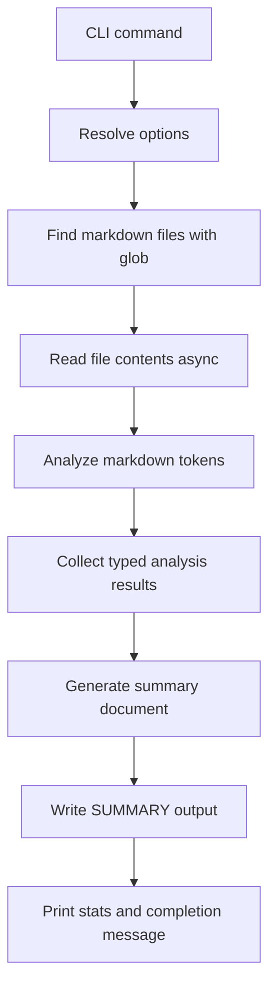

# md-summarizer Implementation Plan

## Goal
Build a TypeScript-based Node.js CLI named `md-summarizer` that scans markdown files, performs deterministic rule-based analysis, and writes a structured summary document without using AI.

## Confirmed Project Metadata
- Package name: `md-summarizer`
- License: `MIT`
- Repository: `https://github.com/yourname/md-summarizer`

## High-Level Architecture

## Execution Flow
1. `bin/cli.js` boots the compiled CLI by requiring `dist/index.js`.
2. `src/index.ts` defines the `summarize` command using Commander.
3. The CLI resolves defaults for directory, output file, include flags, grouping mode, include pattern, and exclusions.
4. Markdown files are discovered via a Promise-based wrapper around `glob`.
5. Each file is read with `fs/promises` and passed to `ContentAnalyzer.analyze`.
6. Each analysis result is accumulated into an array of typed `AnalysisResult` values.
7. `SummaryGenerator.generateDocument` renders the final markdown summary.
8. The summary is written to disk and the CLI reports counts, output path, and completion status with `ora` and `chalk`.

## File-by-File Responsibilities

### `package.json`
- Configure package metadata, binary entry, runtime dependencies, dev dependencies, and scripts.
- Add repository metadata, keywords focused on markdown, cli, summarization, documentation, and static analysis.
- Point `main` and `types` to the compiled `dist` output.

### `tsconfig.json`
- Enable strict TypeScript compilation to `dist` from `src`.
- Emit declaration files and support CommonJS execution.

### `bin/cli.js`
- Add the Node shebang.
- Require `../dist/index.js`.
- Keep the file minimal so the compiled TypeScript remains the real implementation entry point.

### `src/types/index.ts`
- Centralize all domain contracts required by the analyzer and generator.
- Define readonly-friendly interfaces for metadata, document structure, key points, technical details, code examples, links, and rendering options.
- Expose shared union types for complexity, link categories, significance, and audience.

### `src/analyzers/content-analyzer.ts`
- Tokenize markdown with `marked.lexer()`.
- Extract metadata such as title, path, word count, and read time.
- Build heading hierarchy from heading tokens.
- Generate the summary from sentence scoring rather than generative AI.
- Extract key points from headings, lists, emphasized sentences, and high-value prose.
- Detect technical details by matching known languages, frameworks, concepts, APIs, and command-line snippets.
- Extract code examples from fenced code blocks.
- Extract and categorize links.
- Infer audience and complexity from structure, terminology density, code frequency, and document size.

### `src/generators/summary-generator.ts`
- Render a top-level report header with aggregate statistics.
- Build a table of contents with icons and complexity badges.
- Support sequential rendering and grouped rendering.
- Render per-file sections with metadata, narrative summary, key points, technical details, structure outline, code example count, and links.
- Keep output deterministic and readable as markdown.

### `src/index.ts`
- Define a typed options interface for Commander command handling.
- Use `ora` for phases such as discovery, analysis, generation, and write.
- Use `chalk` for success, warning, and error messaging.
- Provide async orchestration, filtering, and file IO.
- Handle empty matches, malformed markdown, and filesystem failures with typed error handling.

### `README.md`
- Describe the project purpose and non-AI rule-based approach.
- Document installation, build, development, usage, and options.
- Provide a realistic sample command and sample output excerpt.
- Include contribution guidance and license reference.

### `.gitignore`
- Exclude generated output, dependencies, logs, local build artifacts, and generated summary files.

## Rule-Based Analysis Design

### Sentence Scoring Heuristics
Each candidate sentence should be scored using additive rules:
- First three sentences receive a position boost.
- Sentences containing high-importance markers receive the largest bonus.
- Sentences containing medium or low markers receive smaller bonuses.
- Each recognized technical term increases relevance.
- Sentence length is rewarded when it is between 5 and 30 words.
- Inline code or code-like references add weight.
- Questions receive a small bonus because they often indicate problem framing.

### Key Point Extraction Sources
Prioritize these sources when producing up to five key points per file:
1. High-significance headings
2. Ordered and unordered list items
3. Sentences with importance markers
4. Sentences with commands, API references, or code spans
5. Early summary-worthy sentences after deduplication

### Technical Detail Extraction
- Match known languages, frameworks, and concepts using normalized lowercase comparisons.
- Detect APIs via code spans, function-like patterns, and references such as HTTP or CLI verbs.
- Detect commands from fenced shell blocks and inline commands.
- Deduplicate values and preserve readable casing in final output.

### Complexity Assessment Inputs
Map complexity into `beginner`, `intermediate`, or `advanced` using a weighted score from:
- Count of fenced code blocks
- Deepest heading level encountered
- Technical term density relative to total words
- Document length by word count

### Audience Inference Inputs
Infer one or more audiences from signals such as:
- `beginners`: tutorial language, getting started sections, examples
- `developers`: APIs, code snippets, implementation details
- `architects`: design, system, integration, tradeoff language
- `operations`: deployment, configuration, runtime, CLI, environment
- `contributors`: contribution, workflow, repository, testing guidance

## Output Design Expectations
Each file summary should contain:
- Document icon chosen from file category or content intent
- Metadata block with file name, path, read time, complexity, and audience
- Narrative summary paragraph based on top-ranked sentences
- Optional key points section capped at five bullets
- Optional technical details section
- Optional structure section showing heading hierarchy with significance markers
- Code example count and important links

## Implementation Notes for Code Mode
- Prefer small helper functions and explicit return types.
- Avoid `any`; use type guards or narrow `unknown` errors in catch blocks.
- Normalize path separators when displaying paths in markdown output.
- Keep analyzer methods pure where possible for easier testing later.
- Use shared utility patterns inside existing source files unless new files become necessary.
- Ensure the generated markdown remains stable across repeated runs on the same input.

## Acceptance Checklist
- Project structure matches the requested layout.
- All source files are written in TypeScript.
- CLI builds with `tsc` and runs through `bin/cli.js` after compilation.
- Markdown discovery, analysis, and summary generation are asynchronous and typed.
- Summary output includes metadata, summary text, key points, technical details, structure, code examples, and links.
- README and package metadata are complete and aligned with the implementation.
